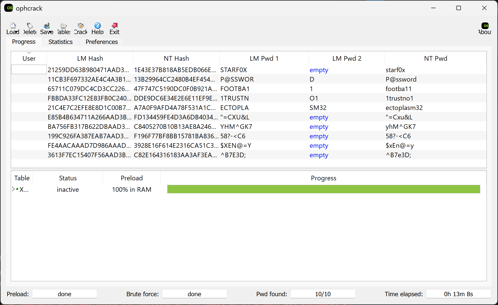

# Password Cracking (Windows & PDF)

## 0. Outline

- [1. What are hashes and their applications](#1-what-are-hashes-and-password-hashing)
- [2. Common Hash Types](#2-common-hash-types)
- [3. Hash Cracking & Tools](#3-hash-cracking-tools)
- [3. Tools for Cracking Password Hashes](#3-tools-for-cracking-password-hashes)
- [4. Cracking Windows Password Hashes](#4-cracking-windows-password-hashes)
- [5. Cracking PDF Passwords](#5-cracking-pdf-passwords)
- [6. Citations](#6-citations)

## 1. What are hashes and their applications

- A **hash** is a fixed-length string of characters generated from input data of any size using a mathematical function called a hash function.
- Hashes are designed to be unique, meaning that even a small change in the input data will produce a completely different hash.

### Applications of hashes include:

- Password hashing: converting a password into a hash using a hash function. To securely store passwords, as hashes are one-way functions and cannot be easily reversed to obtain the original password. (Salting is often used to enhance security by adding random data to the password before hashing.)

- Data integrity: verifying that data has not been altered by comparing the hash of the original data with the hash of the received data.

## 2. Common Hash Types

- **MD5**: Produces a 128-bit hash value, commonly represented as a 32-character hexadecimal number. It is fast but is known to be easily cracked.

- **SHA-1**: Produces a 160-bit hash value, represented as a 40-character hexadecimal number. It is more secure than MD5 but is also known to be easily cracked.

- **SHA-256**: Part of the SHA-2 family, produces a 256-bit hash value, represented as a 64-character hexadecimal number. It is widely used and considered secure.

- **NTLM**: A suite of Microsoft security protocols that includes a hashing algorithm for passwords used in Windows systems. NTLM hashes are 128-bit and represented as a 32-character hexadecimal number. LM hashes, an older and less secure hashing method used in Windows, produce a 128-bit hash value but are considered very weak and easily cracked.

## 3. Hash Cracking & Tools

Hash cracking is the process of attempting to recover the original input (e.g., password) from its hash value. This is typically done using various techniques, including:

- **Brute-force attack**: Trying all possible combinations of characters until the correct one is found. i.e Hashing strings until a match is found.

- **Dictionary attack**: Using a precompiled list of common passwords or phrases to guess the password.

- **Rainbow tables**: Precomputed tables of hash values for common passwords, allowing for faster lookup and cracking.

### Tools for Cracking Password Hashes

- [Ophcrack](https://ophcrack.sourceforge.io/): A Windows password cracker that uses rainbow tables to crack LM and NTLM hashes.

- [Hashcat](https://hashcat.net/hashcat/): A powerful and versatile password cracking tool that supports a wide range of hash types and attack modes. It can utilize GPU acceleration for faster cracking.

- [John the Ripper](https://www.openwall.com/john/): A popular password cracking tool that supports various hash types and is known for its ease of use and effectiveness.

## 4. Cracking Windows Password Hashes

- Windows stores password hashes in the SAM (Security Account Manager) database.
- To extract NTLM hashes from a Windows system, tools like `pwdump` or `fgdump` can be used.
- Once the hashes are extracted, they can be cracked using tools like Hashcat or John the Ripper with appropriate wordlists or brute-force methods. Ophcrack can also be used for cracking LM hashes using rainbow tables.

### Windows Gym Solutions:

#### Using ophcrack with rainbow tables to crack LM hashes.

- [Download and install ophcrack.](https://ophcrack.sourceforge.io/)
- [Obtain the appropriate rainbow tables for LM hashes. (XP special wordlist)](https://ophcrack.sourceforge.io/tables.php)(must download each table separately, and extract them to the same directory)
- Use the md5sum.txt file to check that you have the correct files downloaded and load the folder by clicking Tables.
- Load the individual hashes or a txt file containing all the hashes.
- Click crack and the tool will attempt to crack the hashes using the loaded rainbow tables.
- The results will be displayed in the NT Pwd column.

## 5. Cracking PDF Passwords

- PDF files can be protected with passwords to restrict access or editing.
- The password is used to generate an AES encryption key, which is then used to encrypt the contents of the PDF. The password hash is stored in the PDF file's metadata.
- AES is a symmetric encryption algorithm that uses the same key for both encryption and decryption. The strength of AES depends on the key length, with common key lengths being 128, 192, and 256 bits.
- Cracking a PDF password typically involves first extracting the password hash from the PDF and then running a password cracking tool, such as `pdfcrack` or `John the Ripper`.

### PDF Gym Solutions:

#### Using John the Ripper to crack PDF passwords.
- Download and install John the Ripper. (https://www.openwall.com/john/) or just use Kali Linux which has it pre-installed.
- Use `pdf2john` to extract the password hash from the PDF file: `pdf2john protected.pdf > hash.txt`
- Use John the Ripper to crack the password hash: `john --wordlist=rockyou.txt hash.txt`
- View the cracked password with the following command: `john --show hash.txt`
- password: `keanureeves2008`
- flag: SKY-KANU-5902

## 6. Citations

- [Cyber Skyline Live: Cracking Password Hashes](https://www.youtube.com/watch?v=ll0xcqWF_AM&t=3384s)
- [Cyber Skyline Live: PDF Password Cracking](https://www.youtube.com/watch?v=dd0uBmDwvC0&)
- [Hash Functions and Password Hashing](https://en.wikipedia.org/wiki/Hash_function)
- [Common Hash Types](https://en.wikipedia.org/wiki/List_of_hash_functions)
- [Cracking Windows Password Hashes](https://trove.cyberskyline.com/3f7c50f299f34ae896cc1d4955be2567)
- [Cracking PDF Passwords](https://trove.cyberskyline.com/4f6f61dc54bc47169d7838c2e82bf6d8)
- Copilot for initial outline and structure.
