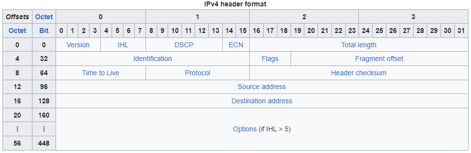

Packet dissection is the process of analyzing and breaking down
network packets into their individual protocol layers and 
fields. This allows detailed inspection of the data being
transmitted over a network, revealing information such as
headers, payload, source and destination addresses, and
protocol-specific details. Packet dissection is essential for
network troubleshooting, security analysis, and performance
monitoring, often performed using tools like Wireshark. It 
helps understand how data flows through networks and detect 
anomalies or malicious activity.

For examining IPv4 packets, you will want to refer to the IPv4
header format:

The numbers 0-3 at the top of the table are the byte numbers.
Below that is the bit numbers 0-31. The rest of the table shows
what different bits on different octets mean.

This is the packet data that we will be working with.

| Offsets | 0        | 1        | 2        | 3        |
|---------|----------|----------|----------|----------|
| 0       | 01000101 | 00000000 | 00000000 | 00111100 |
| 4       | 10101001 | 10011010 | 01000000 | 00000000 |
| 8       | 01000000 | 00000110 | 01001111 | 10010011 |
| 12      | 11000000 | 10101000 | 10000000 | 10000000 |
| 16      | 10011111 | 11001011 | 01100000 | 10011010 |

We will get the infromation out of this by converting the bits
indicated by the header format from binary into whatever
language is needed.

1. What is the header checksum in hexadecimal representation?

The header checksum starts at bit 16 octet 8 and ends at bit 31.
By converting the two bytes in that range into hex, you will get your answer.

2. What is the TTL of the packet?

The TTL is byte 0 of octet 8. By converting that binary to
decimal you will have the answer.

3. What is the source IP address?

The entirety of octet 12 is the source IP address. Convert that
into decimal dot notation for the answer.

4. What is the destination IP address?

The entirety of octet 16 is the destination IP address. Convert
that into decimal dot notation for the answer.

## Wireshark

I was also told to discribe how you would do these in wireshark
so...

To find the header checksum click on an IPv4 packet and expand
the protocol layer, the checksum will be listed in hex 
somewhere inside. The TTL will be located in the same layer.
Acutally so are the source and destination IPs. So instead of
doing binary conversions you just have to read.
